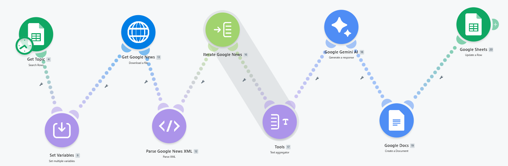

# AI Research Assistant

## Problem

Researching topics manually takes significant time.

## Solution

An automated workflow that:

- Reads topics from Google Sheets
- Retrieves Google News articles
- Parses XML feeds
- Uses Gemini AI for summarization
- Creates Google Docs automatically
- Updates workflow status

## Tools Used

- Make.com
- Google Sheets
- Google News
- Google Gemini
- Google Docs

## Workflow

Google Sheets
↓
Google News
↓
XML Parser
↓
Gemini AI
↓
Google Docs
↓
Update Status

## Future Improvements

- YouTube Research
- Reddit Research
- Research Papers
- Podcast Question Generator

## Workflow Screenshot

